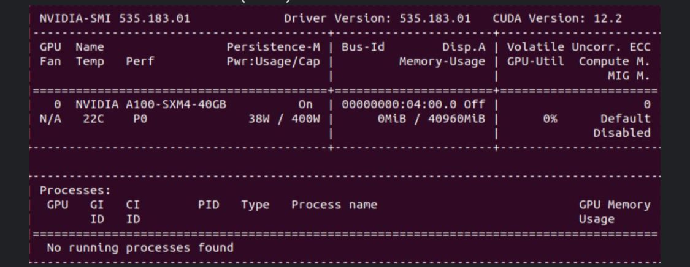

# Fine-tuning Lightweight LLM with LLMEmbed for Domain-Specific Tasks
* Team: 8
* Team Members: Ahmad Muhammad, Carlos Granadillo, Daniel Raj

## Project Objective & Brief Description
This project builds on the work done in the paper titled "LLMEmbed: Rethinking Lightweight LLM's Genuine Function in Text Classification" [1]. The original paper proposed and evaluated a novel methodology called LLMEmbed for text classification using lightweight Large Language Models (LLMs).

[1] C. Liu, H. Zhang, K. Zhao, X. Ju, and L. Yang, "LLMEmbed: Rethinking Lightweight LLM's Genuine Function in Text Classification," 2024. Available at: https://doi.org/10.48550/arXiv.2406.03725

This repository presents:
1. A "reality check" by executing the entire original pipeline proposed in the paper AS-IS, specifically on financial tasks, which are the focus of this project.
2. Brand new code that fine-tunes 3 LLMs at the beginning of the pipeline on financial data, and then uses those fine-tuned models on financial data as part of the pipeline, to test if this domain-specific fine-tuning incorporation actually improves the quality of the predictions on the financial tasks included in the project.

Note: The two financial tasks for which the project was executed (base pipeline, fine-tuning of 3 LLMs, pipeline with fine-tune) are classification tasks, specifically:
1. Sentiment analysis
2. Yes/No question answering


## Code Setup
To execute the whole project end-to-end, follow these instructions:
1. Clone the repository
```bash
git clone https://github.com/CarlosGranadillo/msml-capstone-project-group8.git
```

2. Install all the required dependencies
```bash
pip install -r requirements.txt
```

3. Change to the appropriate directory
```bash
cd LLMEmbed-Finetuning
```

4. Execute the project
```bash
python main.py
```
Alternatively:
```bash
python3 main.py
```

## Code Flow
Executing the project triggers a job that performs the following steps by default:

`dataload` -> `preprocess` -> `embedding extraction (base llm's)` -> `fine tune llm's` -> `embedding extraction (finetuned llm's)` -> `run downstream model on both embeddings` -> `compare model resuts`

The first time you run the code, you need to go through the entire process. However, for easier experimentation, we have set up a series of arguments that allow you to control the code flow and execute only certain steps of the whole process, making code execution faster.

# Walkthrough of Parameters to Control Code Flow
Set the following boolean values according to the tasks below as the `main` function parameters:

### Embeddings extraction using base models
* Set `extract = True` to extract the embeddings

### Preprocessing the data and embeddings extraction
* To save the preprocessed data locally: `save_data_in_local = True`
* Preprocess the data and extract the embeddings: `read_data_from_local = False` to preprocess the data from Hugging Face and extract the embeddings
* Extract embeddings using base LLM models: `use_finetuned_model = False`

### Fine-tune the LLM models
* Set `finetune = True` to fine-tune the base models, additionally choose which model to fine-tune by passing boolean values to `bert`, `roberta`, and `llama2` parameters

### Embeddings extraction using fine-tuned models
* Set `extract = True` to extract the embeddings
* Read the preprocessed data from local storage and extract the embeddings: `read_data_from_local = True` else `False` to preprocess the data from Hugging Face and extract the embeddings
* Extract embeddings using fine-tuned LLM models: `use_finetuned_model = True`


## Important Considerations

1. **Computational Resources**  
   Below are the specifications of the compute resources used to execute this project's code:  
   

2. **Hugging Face Access Token**  
   The LLaMA2 model is gated on the Hugging Face hub. To download the required files for this model and execute the project, you will need appropriate access. This involves a two-step process:
   - Fill out the form on the LLaMA2 model card on Hugging Face.
   - Create an access token on the Hugging Face platform.

